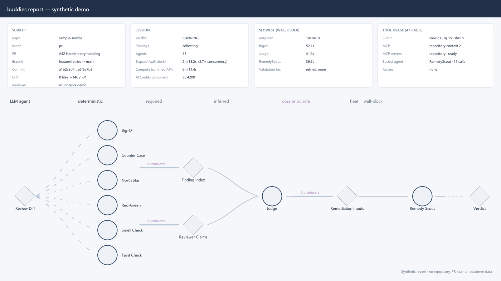

# Roundtable

**Build a team of AI agents as a graph, run it reliably, and inspect how they
reached one result.**

Roundtable is a generic engine for multi-agent workflows. You define the agents,
how work moves between them, and what their outputs must satisfy. Roundtable
runs the team, retries rejected output, and saves the execution so you can
understand the final result.

**Buddies** is one application of the engine. It reviews a code change with six
specialists, checks their evidence and suggested fixes, and produces one
reconciled verdict:



[Explore the full architecture](docs/architecture.md).

What the engine provides:

- **Coordinated work:** agents run in parallel or sequence through explicit
  dependencies.
- **Checked output:** invalid results receive feedback instead of silently
  passing through.
- **Inspectable runs:** an interactive report shows the graph, attempts,
  evidence, and final result.

The broader **InspectorX** code-review team is also included. You can create
other workflows without changing the engine.

## Try Roundtable

### Install

Roundtable requires Python 3.12 or newer. Clone this repository, enter the
checkout, and run the bootstrap:

```text
git clone https://github.com/NirMalka4/Roundtable.git roundtable
cd roundtable
python scripts/bootstrap.py
```

The package is installed from the clone. Roundtable does not currently promise
installation from public PyPI.

Verify the installation:

```text
roundtable --version
roundtable doctor --static
```

Open a new terminal if `roundtable` is not yet on `PATH`. The shorter `rt`
command is equivalent.

### Run without spending model tokens

Run the complete Buddies graph with deterministic sample responses:

```text
roundtable review . --base-branch HEAD~1 --simulate
```

This is a pipeline check, not a real assessment of your code. It prints a
session directory that you can inspect offline:

```text
roundtable view <session-dir>
roundtable report <session-dir> --no-open
```

Generated reports and session artifacts can include local paths, repository or
pull-request URLs, branches, commit identifiers, prompts, and full agent
responses. Inspect and redact them before sharing.

### Review real code

Live execution requires the GitHub Copilot CLI to be installed and signed in.
Your Copilot plan and organization policy must also entitle you to the models
configured by the selected bundle; model availability depends on those settings.

```text
# Review the current branch
roundtable review .

# Use the broader InspectorX team
roundtable review . --config inspectorx

# Review an Azure DevOps pull request
roundtable review --pr <azure-devops-pr-url>
```

For a postmortem, `eval-pr` reviews a historical change as it existed before
deployment, then publishes the saved result through an evaluation-only ADO
draft:

```text
roundtable eval-pr --from-merge-commit <sha> --repo <path-or-ado-url> --name <evaluation-name>
```

## Build another workflow

Roundtable is not limited to code review. A bundle defines the agents, prompts,
dependencies, tools, validation, and output for another workflow:

```text
roundtable run --config <bundle-directory> --input Source=payload.txt --backend copilot --out artifacts
```

Start with the [architecture](docs/architecture.md), [backend
contract](docs/backends.md), and [provider contracts](docs/providers.md).

## Learn more

- [Architecture](docs/architecture.md)
- [Installation](docs/installation.md)
- [Azure DevOps integration](docs/azure-devops.md)
- [CLI reference](docs/cli-reference.md)
- [Contributing](CONTRIBUTING.md)
- [Security policy](SECURITY.md)
- [Code of Conduct](CODE_OF_CONDUCT.md)
- [MIT License](LICENSE)
- [Changelog](CHANGELOG.md)
