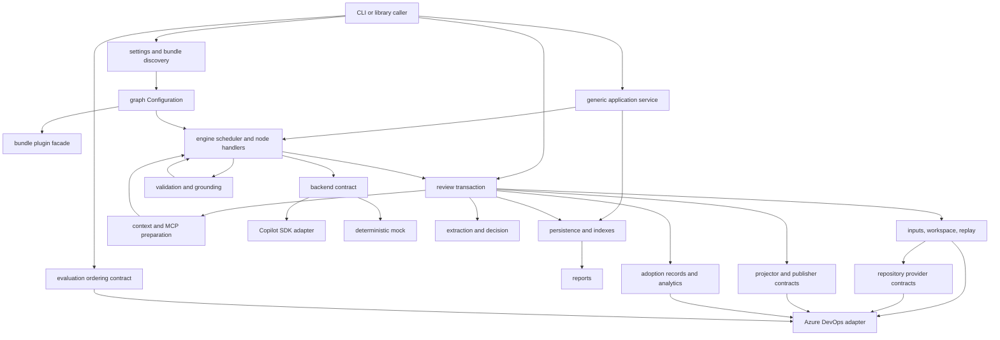
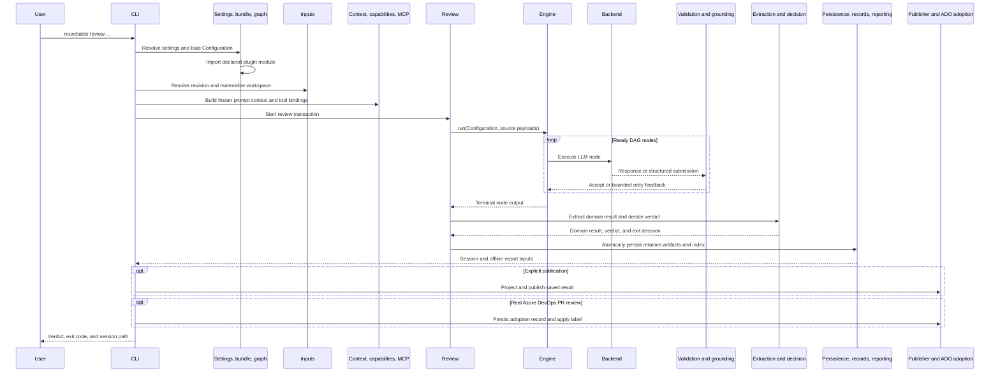

# Architecture

Roundtable has a generic graph runtime, review-domain applications, one shipped
LLM adapter, and one shipped platform adapter. A `Configuration` is explicit
input to the engine; the engine does not read ambient configuration or branch on
a provider name.

## System map

The arrows distinguish contracts from implementations. `roundtable.backend`,
`roundtable.providers`, `roundtable.delivery`, `roundtable.adoption`, and the
core of `roundtable.evaluation` define separate extension boundaries. Copilot is
the only production backend; the mock is deterministic. Azure DevOps is the only
repository, publication, adoption, and evaluation implementation.

Configuration bundles register enrichers, extractors, validation gates,
projectors, and reports only through `roundtable.plugins`. That facade also
exposes deterministic simulation-transform registration for the mock review
path. Registration points inward: generic packages never import a shipped
bundle to discover its behavior.

## Chronological review flow

1. `roundtable.cli` is the provider-aware composition root. It resolves
   `roundtable.settings`, selects a bundle through `roundtable.bundle`, and asks
   `roundtable.graph` for a validated `Configuration`.
2. Graph loading imports only the plugin module declared by that configuration.
   Registrations flow through `roundtable.plugins`; graph structure, predicates,
   tool policy, publishing policy, and fingerprints remain in `roundtable.graph`.
3. `roundtable.inputs` resolves Git and Azure DevOps review identity, constructs
   the exact source/base workspace, and captures replay state. Its compatibility
   path still loads ADO PR metadata through `roundtable.ado_client`. Neutral
   repository identities and provider registration live in
   `roundtable.providers`; broader ADO publication, adoption, and evaluation
   mechanics live in `roundtable.ado`.
4. `roundtable.context` builds the session header, deterministic enrichments,
   corpus injection, diff statistics, and optional hints. `roundtable.capabilities`
   inventories runtime tools; `roundtable.mcp` resolves and prewarms declared MCP
   servers. `roundtable.runtime` supplies agent identity, prompt files, and
   programmatic agent setup.
5. `roundtable.review` starts the review transaction. For workflow-neutral
   callers, `roundtable.application` instead validates source bindings, invokes
   the same engine, and persists a generic report without review semantics.
6. `roundtable.engine` schedules dependency-ready nodes and dispatches by
   declared `kind`. Source and `code_fn` nodes are deterministic; LLM nodes use a
   registered `roundtable.backend`. The engine receives the `Configuration`
   directly and has no ADO implementation dependency.
7. The Copilot SDK bridge is the shipped production backend. The mock backend
   implements the same request/result contract. Schema-backed LLM nodes complete
   only through the reserved structured-submission transport; schema-less nodes
   forward their first successful backend response unchanged.
8. `roundtable.validation` performs schema and registered semantic checks.
   `roundtable.grounding` can replace schema-declared source excerpts with
   checkout facts. `roundtable.consolidation` supplies a deterministic,
   domain-neutral fan-in reducer when a graph's configured code function uses it.
9. Review bundles use `roundtable.extraction`, `roundtable.types`, and
   `roundtable.decision` to interpret the terminal review-domain result and map
   its verdict to an exit code. These packages are not generic engine behavior.
10. `roundtable.persistence` writes atomic traces, graph snapshots, prompt dumps,
    retained tool facts, and usage. `roundtable.records` updates derived session
    indexes. `roundtable.reporting` reads persisted sessions into offline HTML;
    a bundle-selected report callback is registered through
    `roundtable.delivery`.
11. Publication is explicit. `roundtable.delivery` selects a projector and
    publisher; `roundtable.ado` owns PR checks, anchors, iterations, threads,
    labels, deduplication, and retraction. For a real ADO PR review, the ADO
    adoption adapter separately persists the v1 record and applies its label.
    Publication embeds that record's metadata in the executive summary.
12. Replay restores the recorded tool-visible repository and provider context or
    fails. Evaluation reviews before mutation through the neutral
    `roundtable.evaluation` ordering contract; its ADO adapter owns scratch refs,
    draft PRs, REST calls, and cleanup.

## Package responsibilities

| Class | Package | Responsibility |
|---|---|---|
| Generic core | `roundtable.application` | Workflow-neutral source binding, engine invocation, and persistence. |
| Boundary + adapters | `roundtable.backend` | Neutral backend registry, capabilities, execution policy, normalized outcomes, retention, and usage, alongside the shipped Copilot SDK and deterministic mock implementations. |
| Generic core | `roundtable.consolidation` | Pure, lossless, order-independent fan-in records and rendering. |
| Review infrastructure | `roundtable.context` | Review prompt context, session headers, deterministic enrichments, and registered enricher and extractor seams. |
| Generic core | `roundtable.engine` | DAG scheduling, node-kind dispatch, attempts, executor selection, and run results. |
| Generic core | `roundtable.graph` | `Configuration`, graph loading, schema validation, predicates, fingerprints, plugin loading, and graph policies. |
| Generic core | `roundtable.grounding` | Opt-in schema-directed replacement of narrated excerpts with source facts. |
| Generic core | `roundtable.persistence` | Atomic session artifacts, graph snapshots, prompt dumps, tool redaction, traces, and usage summaries. |
| Generic core | `roundtable.providers` | Neutral repository, change-request, and revision identity contracts and registry. |
| Generic core | `roundtable.utils` | Low-level JSON extraction compatibility helpers. |
| Generic core | `roundtable.validation` | Structured submission schemas, JSON Schema loading, diagnostics, gate registry, semantic pipeline, and retry feedback. |
| Review boundary | `roundtable.adoption` | Neutral adoption records and provider contract, strict ADO v1 compatibility codec, JSONL query, and offline report. |
| Review domain | `roundtable.decision` | Verdict vocabulary, rendering, and process-exit mapping. |
| Review domain | `roundtable.delivery` | Review-result projectors, reports, publisher/retraction contracts, registries, and compatibility Sink names. |
| Boundary + compatibility | `roundtable.evaluation` | Neutral review-before-mutation evaluation contract plus compatibility exports for the ADO implementation. |
| Review domain | `roundtable.extraction` | Typed review-domain result and finding extraction. |
| Review domain | `roundtable.review` | End-to-end review transaction, review agent inputs, acceptance checks, and trace overlays. |
| Review domain | `roundtable.types` | Shared severity, exploitability, and verdict vocabulary helpers. |
| Adapter | `roundtable.ado` | Azure DevOps repository provider, publishing, adoption collection/recording, evaluation refs and drafts, and cleanup. |
| Adapter | `roundtable.ado_client` | Shared ADO authentication, host allow-listing, URL construction, and REST transport primitives. |
| Bundle/config | `roundtable.bundle` | Bundle discovery, active paths, prompt roots, and Roundtable home migration. |
| Bundle assets | `roundtable.configs` | Shipped Buddies and InspectorX graphs, prompts, schemas, gates, and plugin implementations. |
| Infrastructure | `roundtable.capabilities` | Static and authenticated runtime/tool capability inventory. |
| Infrastructure | `roundtable.inputs` | Git context, PR metadata, workspaces, repository detection, frozen replay capture, and restoration. |
| Infrastructure | `roundtable.mcp` | Declarative MCP registry, bindings, tool inventory, ADO server selection, and prewarming. |
| Infrastructure | `roundtable.records` | Derived repository/session indexes over persisted artifacts. |
| Infrastructure | `roundtable.reporting` | Persisted-session loading, graph layout, tool-surface comparison, and self-contained HTML. |
| Infrastructure | `roundtable.runtime` | Agent identity, branding, system-prompt loading, MCP needs, and runtime agent setup. |
| Infrastructure | `roundtable.settings` | User/workspace settings, precedence, legacy environment aliases, and ADO auth selection. |
| Packaged assets | `roundtable.skills` | Explicit-review skill content used by the skill lifecycle commands; this directory is package data rather than a Python facade. |

## Root boundaries and guards

| Module | Boundary |
|---|---|
| `roundtable.cli` | Provider-aware command parsing and composition; it is not engine core. |
| `roundtable.plugins` | The sole typed registration facade for bundle enrichers, extractors, gates, projectors, and reports. |
| `roundtable.import_boundary` | Shared AST import-denylist mechanism. |
| `roundtable.context_boundary`, `roundtable.persistence_boundary`, `roundtable.validation_boundary` | Doctor checks that generic packages do not import bundles or review-domain packages. |
| `scripts/check_package_boundaries.py` | Enforces cross-package imports through each top-level package facade and requires literal facade exports. |
| `roundtable.feedback` | Dependency-light deviation and retry-feedback value objects shared by validation and orchestration. |
| `roundtable.result_access` | Normalizes live and persisted result shapes for consumers. |
| `roundtable.simulation` | Registry for deterministic mock-output transforms. |
| `roundtable.artifact_worker` | Isolated artifact-operation worker used by command delegation. |
| `roundtable.review_skill` | Installation, status, and removal of the packaged explicit-review skill. |
| `roundtable.updater`, `roundtable._update_helper` | Self-update orchestration and isolated replacement helper. |
| `roundtable._version` | Single source for the package version consumed by build and runtime metadata. |
| `roundtable.rebrand_guard` | Static guard against stale product naming. |

The generic core guards use a denylist because core packages have many valid
generic neighbors. `scripts/check_package_boundaries.py` separately enforces the
facade rule for every top-level package. Both checks run through the repository
pre-flight; the context, persistence, and validation guards also run through
`roundtable doctor`.

## Extension rule

Add an integration by implementing and registering the narrow contract it
needs. Do not introduce a universal provider, provider-name branches in the
engine, ambient configuration reads, or imports from generic core back into a
bundle or review-domain implementation.
